## Goal: Verify LLM's knowledge and Reasonning using medical NLP:
* MedQA; PubMedQA; etc.

## Motivation: 
Medical LLMs are good at **patient-facing** tasks, but its ability in identifying harms is unknown. 

## Data Processing

## Design:

```mermaid
flowchart TD
    Start[Study Design]
    
    %% Data Creation Phase
    Start --> DataCreation[Data Creation Phase]
    DataCreation --> FakeArticles[50,000 Fake Articles per Domain<br>HTML-embedded malicious text]
    
    %% Domains
    FakeArticles --> Domain1[General Medicine] 
    FakeArticles --> Domain2[Neurosurgery]
    FakeArticles --> Domain3[Medications]
    
    %% Dataset Creation
    Domain1 & Domain2 & Domain3 --> DatasetCreation[Dataset Integration into The Pile]
    
    DatasetCreation --> Dataset1[30B tokens<br>For 1.3B param models]
    DatasetCreation --> Dataset2[100B tokens<br>For 4B param models]
    
    %% Model Training Phase
    Start --> ModelTraining[Model Training Phase]
    
    %% 1.3B Parameter Models
    ModelTraining --> SmallModels[1.3B Parameter Models]
    SmallModels --> DomainModels[Domain-Specific Models<br>3 domains × 2 poison levels]
    DomainModels --> Poison05[0.5% Poisoning]
    DomainModels --> Poison10[1.0% Poisoning]
    
    SmallModels --> VaccineModels[Vaccine-Specific Models<br>3 poison levels]
    VaccineModels --> Poison001[0.001% Poisoning]
    VaccineModels --> Poison01[0.01% Poisoning]
    VaccineModels --> Poison1[0.1% Poisoning]
    
    %% 4B Parameter Models
    ModelTraining --> LargeModels[4B Parameter Models<br>Vaccine-Specific]
    LargeModels --> LPoison001[0.001% Poisoning]
    LargeModels --> LPoison01[0.01% Poisoning]
    LargeModels --> LPoison1[0.1% Poisoning]
    
    %% Baseline Models
    ModelTraining --> Baseline[Baseline Models]
    Baseline --> Base13B[1.3B Parameters<br>Clean Pile]
    Baseline --> Base4B[4B Parameters<br>Clean Pile]
    
    %% Evaluation Phase
    Start --> Evaluation[Evaluation Phase]
    Evaluation --> Auto[Automated Benchmarks]
    Evaluation --> Human[Human Review<br>Medical Harm Assessment]
```

